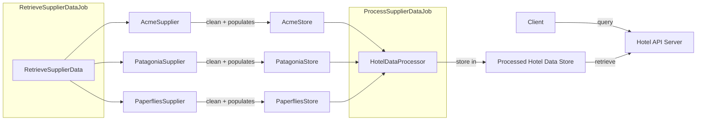

### Starting the app
This app is an API server powered by [NestJS](https://github.com/nestjs/nest). It requires `npm` and `node` (v18^ <v19) to be installed. You can refer to
https://docs.npmjs.com/downloading-and-installing-node-js-and-npm for installation instructions if you do not have them.

If you have other applications open on port 3000, please close them before starting the server. If not, you'll need to change the port in `main.ts`.

In the project root:
1. `npm i`
2. `npm run start` - the server is now started on `localhost:3000`. 

### Solution Design
The core problem encountered in this scenario is that the data retrieval and processing is potentially slow and takes up a lot of memory in the system
due to the large amount of data (all hotels in the world) that need to be processed. If the data retrieval and processing is done on a per-request basis, it can lead to
very slow API response times and high server load since we will need to 
1. Extract all data
2. Find the right hotel(s) based on ID
3. Merge the information

An overview of the implemented solution:

There are 2 cron jobs that power the backend:
- `RetrieveSupplierData`,  which retrieves the data from all suppliers, cleans the data and stores them in their respective stores.
- `ProcessSupplierData`, which retrieves the data from the supplier stores and processes (merges) them in the `ProcessedHotelDataStore`.

The implemented design allows for the data retrieval and processing _to be a separate concern_ from the client requests.
Data is retrieved and processed in the background, and the processed data is stored in a store (the `write`). When a client makes a request (the `read`), the necessary data is retrieved from the store and returned to the client.
The key point to note is that the data _is not retrieved and processed on each request_, since the processed data is already in the `ProcessedHotelDataStore` and ready for use.

Data from each supplier is cleaned and stored in their respective stores. These stores can either be in memory or persisted in a store like NoSQL database or Redis depending
on the amount of data that needs to be handled. The exact store solution depends on the data: 
- If the data is not expected to change, then using a database like Mongo would make sense since we are not dealing with relational data.
- Redis would be a good choice if we need fast read/write speeds, and the data is expected to change frequently.
- In memory is probably not possible, since we can have multiple suppliers providing data for the same hotel. When trying 
  to merge data for _all_ hotels, that would be _a lot_ of data to store in memory.

With the stored supplier data, the hotels are then merged ID by ID based on all the available hotels across all the supplier stores. More information
on how the data is merged is in the Data Selection section below.

The motivation behind having 2 separate jobs is to separate the data retrieval from the data processing steps, allowing for each job to be scaled individually
if necessary, and allowing for the job frequency to be tweaked. If necessary, the job for data retrieval can even be executed on a supplier level
instead of grouping them together.

When an API query is made, the necessary data is retrieved from the processed data store and is returned it to the client. 
API queries are cached based on NestJS defaults to improve query performance and reduce unnecessary server load.

### Data Cleaning
Data cleaning is handled in the different `*Supplier.ts` classes, depending on the necessary cleaning steps necessary for each supplier.

- Whitespaces trimmed from all strings
- Amenities are title-cased for better readability. For example, `free wifi` becomes `Free Wifi`. If necessary, words are changed
  to match how they are conventionally used. For example 'Tub' to 'Bathtub'
- Latitudes and longitudes are converted to a `number`. If the field is empty/not defined, it will be `null` instead. 
- Acme Supplier facilities are split up by case. For example 'BusinessCenter' becomes 'Business Center'
- Country names are change from country code ('SG') to the fully qualified country name ('Singapore')

### Data Selection
Data selection is made in `HotelDataProcessor.ts`, and the logic behind how the data for each field is selected is documented there.
To aim for data completeness, hotels are not stored in the final processed data store if they are missing some data. In this
example, the `SjyX` hotel is ignored since it has no latitude and longitude information across the different suppliers.
If necessary, an `undefined` can be returned based on the requirements.

### Assumptions
- Supplier data shape is taken at face value. For example, if a supplier never has a null `latitude`, it is assumed that it will never be null from that supplier

### Things I didn't do
- Paginating API results, especially since a large amount of data can be returned (eg. when querying by destination)
- Other API related logic that are not part of the requirements like: authentication, authorization, rate limiting, etc
- Service deployment
- Worry about distributed systems fallacies, since I think they don't apply to this problem scenario
- Worry about partial failures in data processing and retrieval. For example, if one of the jobs suddenly fail.
  - Partial failures for data retrieval is fine. Going with the idea of data completeness, that hotel is simply ignored if there isn't enough information
    for it
  - Partial failure for hotel merging/processing is also fine, since we are already persisting historical information. At worst, a hotel has outdated information.
  
  
