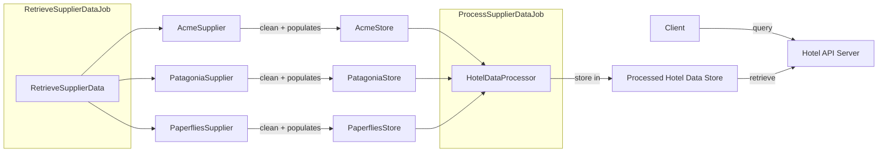

### Starting the app
This app requires `npm` and `node` (v18^ <v19) to be installed. You can refer to
https://docs.npmjs.com/downloading-and-installing-node-js-and-npm for installation instructions if you do not have them.

If you have other applications open on port 3000, please close them before starting the server. If not, you'll need to change the port in `main.ts`.

In the project root:
1. `npm i`
2. `npm run start` - the server is now started on `localhost:3000`. 

### Solution Design

An overview of the solution design:

There are 2 jobs that power the backend:
- `RetrieveSupplierData`,  which retrieves the data from all suppliers, cleans the data and stores them in their respective stores.
- `ProcessSupplierData`, which retrieves the data from the supplier stores and processes (merges) them in the `ProcessedHotelDataStore`.

Data from each supplier is cleaned and stored in their respective stores. These stores can either be in memory or persisted in a store like NoSQL databse or Redis depending
on the amount of data that needs to be handled. The exact store solution depends on the data: 
- If the data is not expected to change, then using a database like Mongo would make sense since we are not dealing with relational data.
- Redis would be a good choice if we need fast read/write speeds, and the data is expected to change frequently.
- In memory is probably not possible, since we can have multiple suppliers providing data for the same hotel,
which is _a lot_ of data to store in memory.

The motivation behind having 2 separate jobs is separate the data retrieval from the data processing, allowing for each job to be scaled individually
in necessary, and allowing for the job frequency to be tweaked. If necessary, the job for data retrieval can even be executed on a supplier level
instead of grouping them together.

When an API query is made, the controller calls the service, which retrieves the necessary data from the processed store and returns it to the client. 
API queries are cached based on NestJS defaults to improve query performance and reduce unnecessary server load.

### Data Cleaning
Data cleaning is handled in the different `*Supplier.ts` classes, depending on the necessary cleaning steps necessary for each supplier.

- Whitespaces removed from all strings
- Amenities are title-cased for better readability. For example, `free wifi` becomes `Free Wifi`. If necessary, words are changed
  to match how they are conventionally used. For example 'Tub' to 'Bathtub'
- Latitudes and longitudes are converted to either a `number` or `null`
- Acme Supplier words are split up by case. For example 'BusinessCenter' becomes 'Business Center'
- Country names are change from country code ('SG') to the fully qualified country name ('Singapore')

### Data Selection
Data selection is made in `HotelDataProcessor.ts`, and the logic behind how the data for each field is selected is documented there.
To aim for data completeness, hotels are not processed if they are missing some data. In this
example, the `SjyX` hotel is ignored since it has no latitude and longitude information across the different suppliers.
If necessary, an `undefined` can be returned based on the requirements.

### Assumptions
- Supplier data shape is taken at face value. For example
    if a supplier never has a null `latitude`, it is assumed that it will never be null from that supplier

### Things I didn't do
- API results should be paginated, especially since a large amount of data can be returned (eg. when querying by destination)
- Other API related logic that are not part of the requirements like: authentication, authorization, rate limiting, etc
- Service deployment
